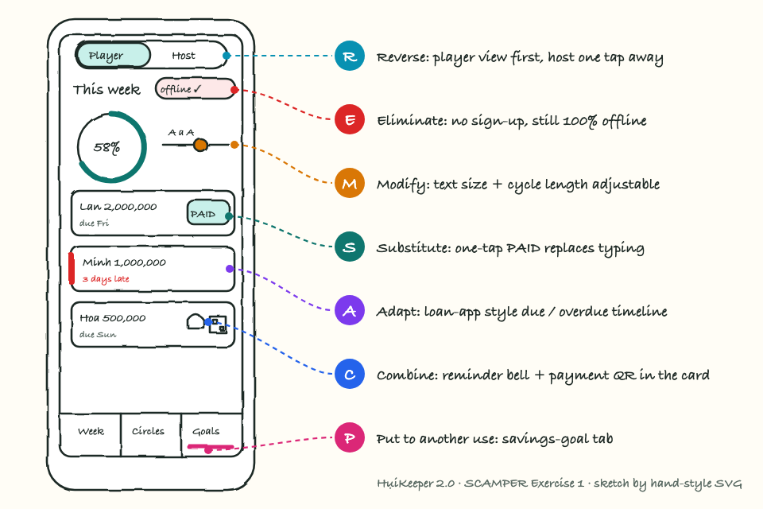

# HụiKeeper 2.0 — SCAMPER Exercise 1

HụiKeeper 2.0 keeps the promise of the current app, a free, offline ledger for personal hụi circles, and removes the friction around it. Players see this week’s dues first and mark a payment with one tap or a receipt photo. A payment card carries a reminder and a QR code and can be shared as an image to the circle’s group. Text size, cycle length and view (player or host) are adjustable, and the same ledger can track a personal savings goal. There is no sign-up and no server: everything stays on the phone.
